# LAW Tugas 2

## Quickstart

1. create virtual environment untuk masing masing microservice

2. install semua modul yang ada pada requirements.txt

3. jalankan oauth pada port 8000(penting), file compress pada port 8010, file upload pada port 8020, file metadata pada port 8030

4. dapatkan token dengan:  

``` curl
curl --location --request POST 'http://localhost:8000/o/token/' \
--header 'Content-Type: application/x-www-form-urlencoded' \
--data-urlencode 'client_id=EuF0PvVdlG0CnrKUOaLA3OL4cci1YJUFmZKCvqwj' \
--data-urlencode 'client_secret=CiDMsofQHa1ZjOIUM5pyZuJDbNIilCdCCpURFwr3NHuoCNGG3Rcg1si7Yjga6L6gGv2E4hiKoLzddWs7G85ZzHzcnPB4Jtjv9IiufEZqvSQuQ5fWan29BiVJmDnpgZf5' \
--data-urlencode 'grant_type=password' \
--data-urlencode 'username=test' \
--data-urlencode 'password=akun_test'
```

5. cara penggunaan endpoint lainya dapat dilihat pada postman collection yang ada.

## Skenario testing

1. file compress (normal&unathorized) 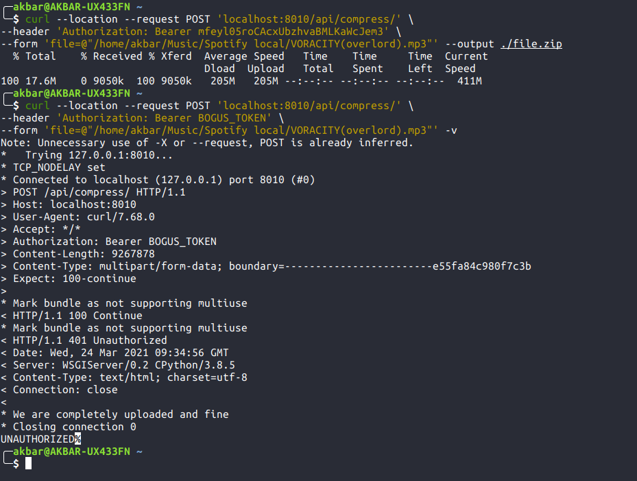

2. file compress result 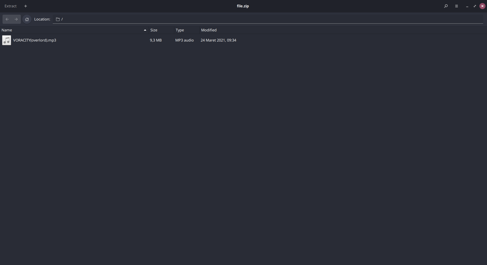

3. upload file 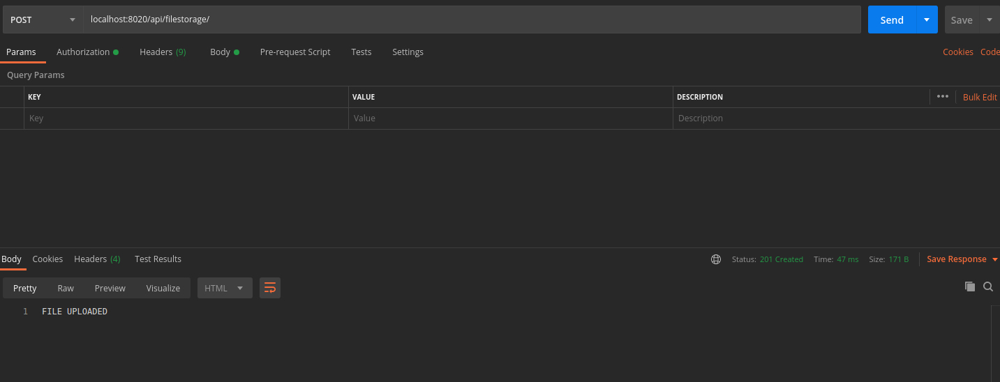

4. upload file already exist 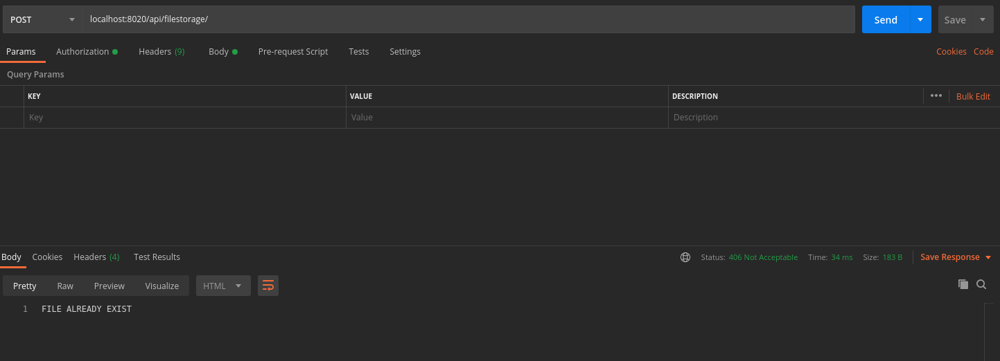

5. download file 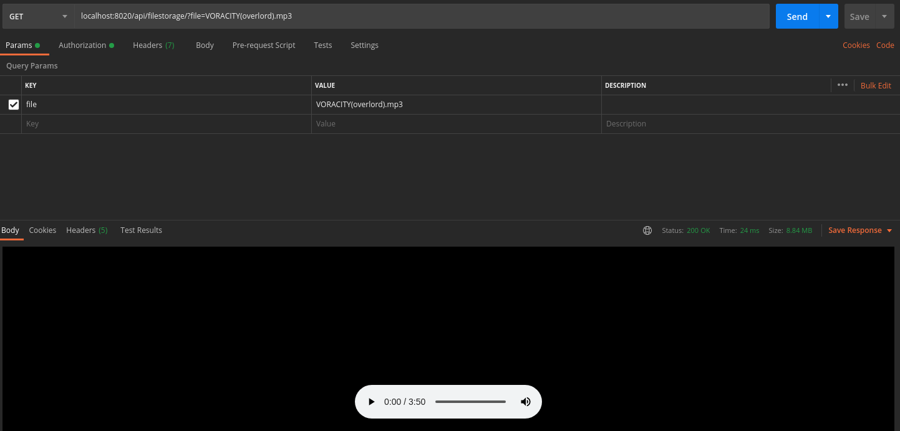

6. download file 404 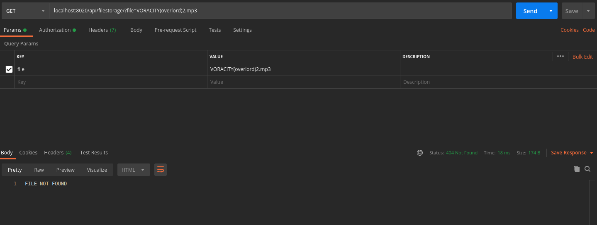

7. post metadata 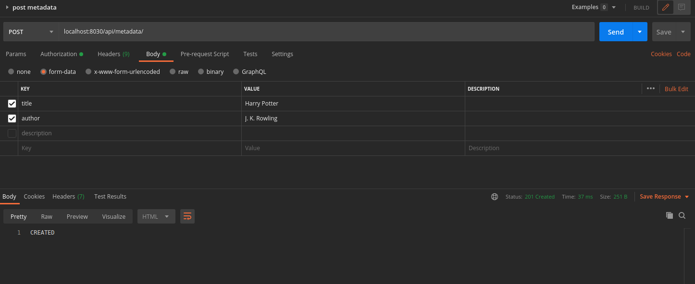

8. post metadata without title 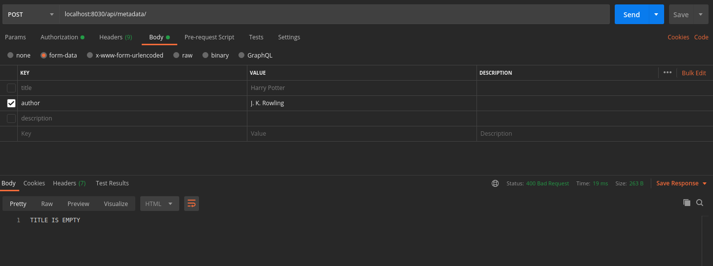

9. get metadata 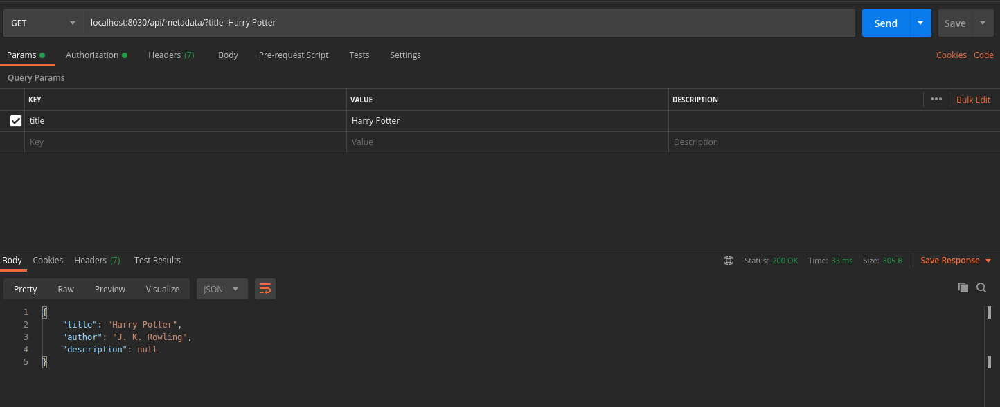

10. get metadata 404 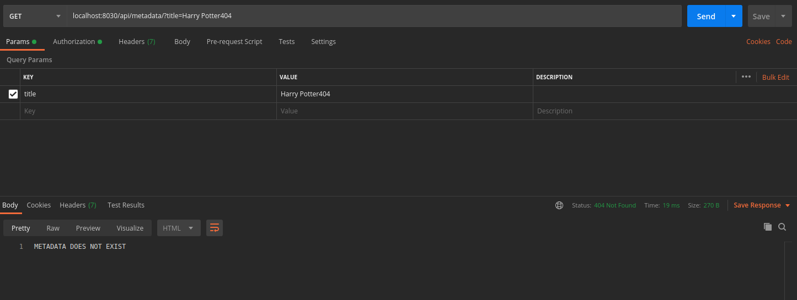

11. update metadata 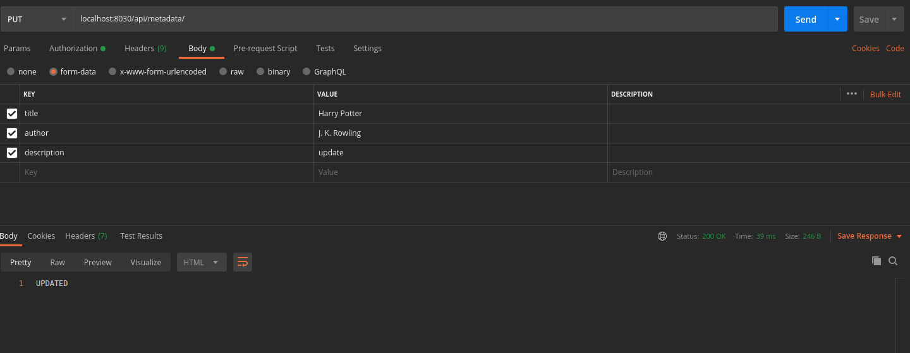

12. update metadata 404 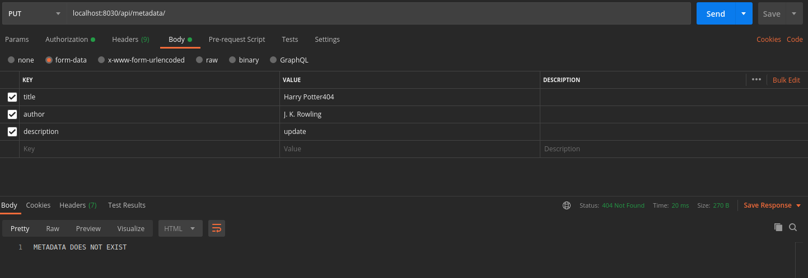

13. delete metadata 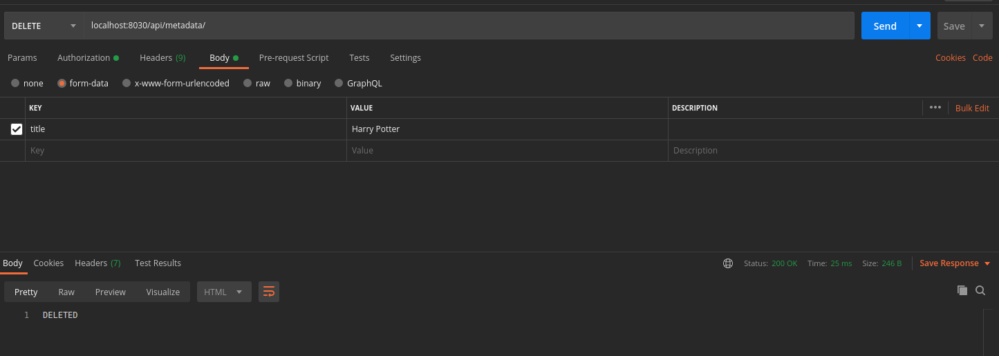

14. delete metadata 404 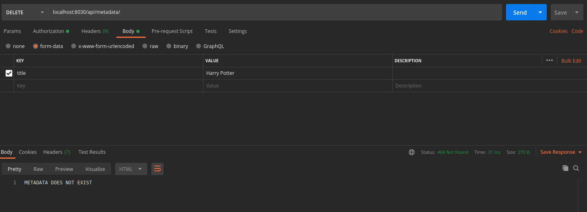

## Sidenotes

1. kodenya belum production ready, jadi jangan di deploy

2. hati-hati saat menggunakan postman pada compress data karena hasil kembalianya tidak di support oleh postman, sehingga akan membuat lag berat(direkomendasikan menggunakan curl).
